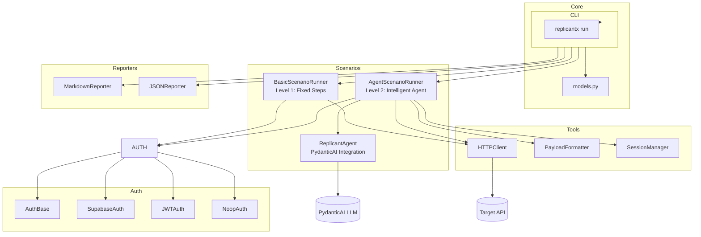
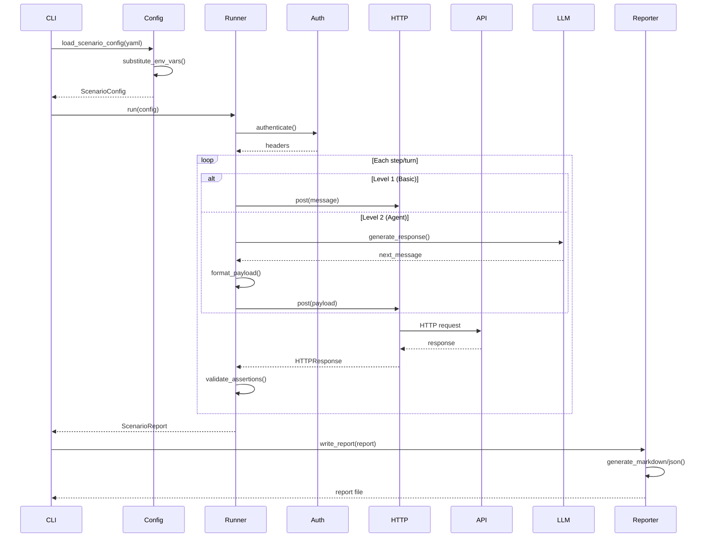
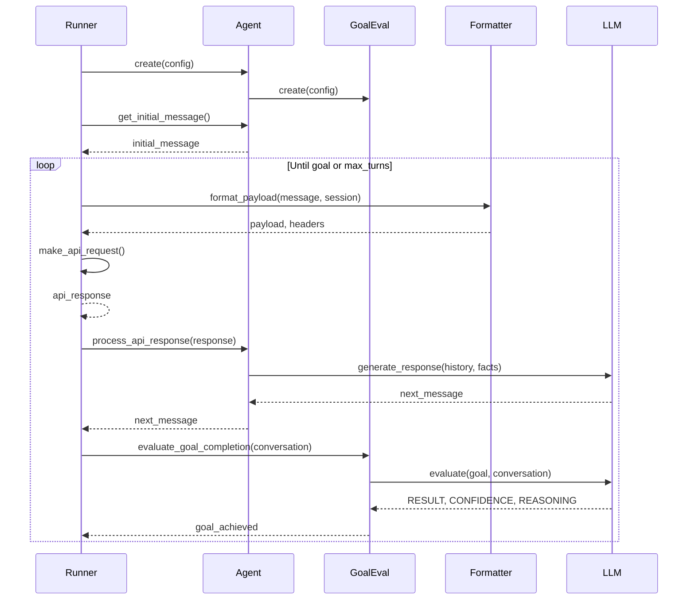
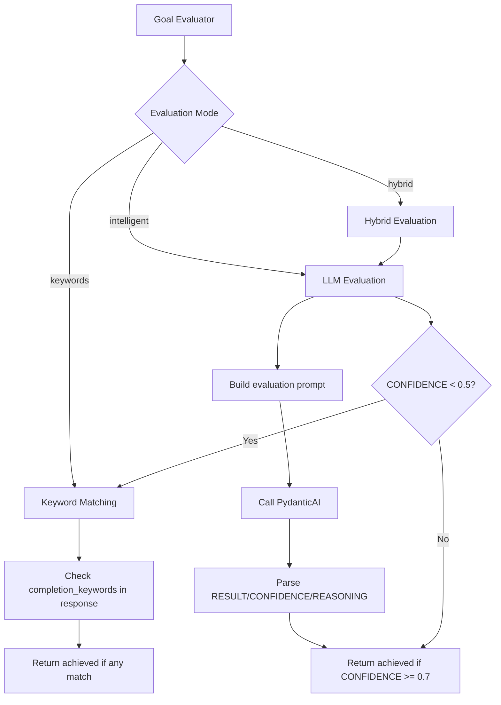

# Codebase Map

> Auto-generated by Cartographer. Last mapped: 2025-03-01

## System Overview

ReplicantX is an end-to-end testing harness for AI agents that communicate via HTTP APIs. It supports both fixed-step tests and intelligent AI-powered conversations with multiple authentication methods, session management, and detailed reporting.



## Directory Structure

```
replicantx/
├── cli.py                    # CLI entry point (Typer)
├── models.py                 # Pydantic models for all data structures
├── scenarios/                # Test scenario runners
│   ├── basic.py              # Fixed-step scenarios (Level 1)
│   ├── agent.py              # Intelligent agent scenarios (Level 2)
│   └── replicant.py          # PydanticAI-based agent implementation
├── auth/                     # Authentication providers
│   ├── base.py               # Abstract base class
│   ├── supabase.py           # Supabase email/password auth
│   ├── jwt.py                # JWT token auth
│   └── noop.py               # No-op authentication
├── reporters/                # Output formatters
│   ├── markdown.py           # Markdown report generation
│   └── json.py               # JSON report generation
└── tools/                    # Utility modules
    ├── http_client.py        # Async HTTP client with retry logic
    ├── payload_formatter.py  # API payload format support
    └── session_manager.py    # Session state management
```

## Module Guide

### Core Package

#### `cli.py` (4,692 tokens)
**Purpose**: Main CLI entry point using Typer
**Entry point**: `replicantx` command
**Key functions**:
- `run()` - Execute test scenarios with flags for ci/debug/watch/parallel
- `validate()` - Validate YAML files without running
- `load_scenario_config()` - Load and parse YAML with env var substitution
- `substitute_env_vars()` - Replace `{{ env.VAR_NAME }}` patterns

**Exports**: `app` (Typer application), `run`, `validate`

**Dependencies**: typer, yaml, rich, dotenv, all scenario runners

**Gotchas**:
- Environment variable substitution fails if variable missing
- Parallel mode uses asyncio with semaphore-based concurrency
- `--debug` shows HTTP payloads and AI prompts
- `--watch` shows live conversation with timestamps
- CI mode (`--ci`) exits with code 1 on failures

---

#### `models.py` (3,351 tokens)
**Purpose**: Pydantic models for configuration and results
**Entry point**: All data structures
**Key models**:
- `ScenarioConfig` - Top-level test configuration
- `ReplicantConfig` - Agent-level configuration
- `AuthConfig` - Authentication configuration
- `LLMConfig` - LLM model configuration
- `Step`, `StepResult` - Basic test steps
- `ScenarioReport`, `TestSuiteReport` - Results
- Enums: `AuthProvider`, `TestLevel`, `AssertionType`, `PayloadFormat`, `SessionMode`, `GoalEvaluationMode`

**Exports**: All model classes and enums

**Dependencies**: pydantic v2

**Gotchas**:
- Uses `extra="forbid"` - unknown fields in YAML cause validation errors
- `goal_evaluation_mode="intelligent"` requires valid LLM model
- Session management requires matching payload format (e.g., `openai_session`)

---

### Scenarios Module

#### `scenarios/basic.py` (3,013 tokens)
**Purpose**: Runner for Level 1 (basic) fixed-step scenarios
**Entry point**: `BasicScenarioRunner`
**Key methods**:
- `run()` - Execute all steps sequentially
- `_execute_step()` - Run single step with HTTP request and assertions
- `_validate_assertions()` - Check contains, regex, equals, not_contains

**Exports**: `BasicScenarioRunner`

**Dependencies**: models, auth, tools/http_client, tools/payload_formatter

**Gotchas**:
- Fails immediately on step failure (doesn't continue)
- Assertions are case-insensitive for contains/not_contains

---

#### `scenarios/agent.py` (6,636 tokens)
**Purpose**: Runner for Level 2 (agent) intelligent conversation scenarios
**Entry point**: `AgentScenarioRunner`
**Key methods**:
- `run()` - Main conversation loop until goal or max turns
- `_execute_conversation_step()` - Single turn with message generation
- `_make_api_request()` - Format payload with session, make HTTP call
- `_validate_api_response()` - Validate response is meaningful
- `_parse_streaming_response()` - Handle SSE streaming responses

**Exports**: `AgentScenarioRunner`

**Dependencies**: models, auth, ReplicantAgent, tools/http_client, tools/payload_formatter, tools/session_manager

**Gotchas**:
- Conversation stops if any step fails
- Goal achievement is separate from step success
- Streaming responses must have `type: "final"` with `response` field
- Session headers are merged with auth headers

---

#### `scenarios/replicant.py` (4,539 tokens)
**Purpose**: PydanticAI-based intelligent agent for conversational testing
**Entry point**: `ReplicantAgent.create()`
**Key classes**:
- `ReplicantAgent` - Main agent with conversation management
- `GoalEvaluator` - Evaluates if goal is achieved (keywords/intelligent/hybrid)
- `ResponseGenerator` - Generates responses using PydanticAI

**Exports**: `ReplicantAgent`, `ConversationState`, `GoalEvaluator`, `ResponseGenerator`

**Dependencies**: pydantic_ai, datetime, models

**Gotchas**:
- Verbose mode (`--verbose`) prints complete system prompts
- Goal evaluation expects specific format: `RESULT:`, `CONFIDENCE:`, `REASONING:`
- Conversation history truncated to last 6 messages for evaluation
- Date/time automatically injected into agent context

---

### Authentication Module

#### `auth/base.py` (408 tokens)
**Purpose**: Abstract base class for authentication providers
**Entry point**: `AuthBase` (ABC)
**Key methods**:
- `authenticate()` - Abstract - must return auth token
- `get_headers()` - Abstract - must return headers dict
- `token()` - Cached token getter
- `invalidate_token()` - Force re-authentication

**Exports**: `AuthBase`, `AuthenticationError`

**Dependencies**: abc

**Gotchas**: Template method pattern - subclasses must implement abstract methods

---

#### `auth/supabase.py` (886 tokens)
**Purpose**: Supabase email/password authentication
**Entry point**: `SupabaseAuth(config)`
**Key methods**:
- `authenticate()` - Call Supabase client `sign_in_with_password()`
- `_get_client()` - Create Supabase client with env var substitution

**Exports**: `SupabaseAuth`

**Dependencies**: supabase, models, auth/base

**Gotchas**:
- Requires: `email`, `password`, `project_url`, `api_key` in config
- All values support `{{ env.VAR_NAME }}` syntax
- Caches session and token

---

#### `auth/jwt.py` (568 tokens)
**Purpose**: Pre-minted JWT token authentication
**Entry point**: `JWTAuth(config)`
**Key methods**:
- `authenticate()` - Return token from config with env var substitution

**Exports**: `JWTAuth`

**Dependencies**: models, auth/base

**Gotchas**:
- Token must be in `config.token` field
- Adds `Authorization: Bearer <token>` header

---

#### `auth/noop.py` (258 tokens)
**Purpose**: No-op authentication for testing or public APIs
**Entry point**: `NoopAuth(config)`
**Key methods**:
- `authenticate()` - Return empty string
- `get_headers()` - Return `Content-Type: application/json` only

**Exports**: `NoopAuth`

**Dependencies**: models, auth/base

**Gotchas**: Still adds custom headers from `config.headers`

---

### Reporters Module

#### `reporters/markdown.py` (2,592 tokens)
**Purpose**: Generate human-readable Markdown reports
**Entry point**: `MarkdownReporter`
**Key methods**:
- `write_scenario_report()` - Write single scenario to file
- `write_test_suite_report()` - Write full test suite to file
- `_generate_scenario_markdown()` - Create MD for scenario
- `_generate_test_suite_markdown()` - Create MD for suite

**Exports**: `MarkdownReporter`

**Dependencies**: models, pathlib

**Gotchas**:
- Creates parent directories via `path.parent.mkdir(parents=True)`
- Truncates text at 50 chars for tables, 80 for justification
- Includes goal evaluation details with confidence and reasoning

---

#### `reporters/json.py` (1,960 tokens)
**Purpose**: Generate machine-readable JSON reports
**Entry point**: `JSONReporter`
**Key methods**:
- `write_scenario_report()` - Write scenario JSON
- `write_test_suite_report()` - Write suite JSON
- `to_json_string()` - Convert to JSON string (no file)

**Exports**: `JSONReporter`

**Dependencies**: models, json, datetime

**Gotchas**:
- Includes `default=str` for non-serializable objects
- Different serialization for keyword vs intelligent goal evaluation
- Adds metadata with generator version and timestamp

---

### Tools Module

#### `tools/http_client.py` (2,106 tokens)
**Purpose**: Async HTTP client with retry logic and timing
**Entry point**: `HTTPClient(base_url, auth_provider, timeout, max_retries)`
**Key methods**:
- `get()`, `post()`, `put()`, `delete()` - HTTP methods
- `_request_with_retry()` - Retry with exponential backoff
- `_make_request()` - Single request with timing
- `close()` - Close the httpx client

**Exports**: `HTTPClient`, `HTTPResponse`

**Dependencies**: httpx, time, auth/base

**Gotchas**:
- Default timeout: 30 seconds
- Default retries: 3 with 2x backoff
- Raises `httpx.HTTPError` after all retries exhausted
- Response.content is string (extracted via `response.text`)

---

#### `tools/payload_formatter.py` (1,934 tokens)
**Purpose**: Format conversation data into different API payload formats
**Entry point**: `PayloadFormatter` (static methods)
**Key methods**:
- `format_payload()` - Main formatting method
- `get_session_url()` - Get URL for session-aware requests (RESTful)
- `_format_openai()` - `{"messages": [{"role": "...", "content": "..."}]}`
- `_format_simple()` - `{"message": "..."}`
- `_format_anthropic()` - Similar to OpenAI
- `_format_legacy()` - `{"message": "...", "timestamp": "...", "conversation_history": [...]}`
- Session-aware variants: `_format_openai_session()`, `_format_simple_session()`, `_format_restful_session()`

**Exports**: `PayloadFormatter`

**Dependencies**: models, tools/session_manager

**Gotchas**:
- Session-aware formats require enabled `SessionManager`
- RESTFUL_SESSION with URL placement returns path like `/conversations/{session_id}/messages`
- Calls `session_manager.update_activity()` on every format

---

#### `tools/session_manager.py` (853 tokens)
**Purpose**: Manage conversation session lifecycle and state
**Entry point**: `SessionManager(config)`
**Key methods**:
- `_initialize_session_id()` - Generate or load session ID based on mode
- `_generate_session_id()` - Create UUID or replicantx_xxxxxxxx format
- `update_activity()` - Reset last_activity timestamp
- `is_expired()` - Check if timeout exceeded
- `is_enabled()` - Check if sessions are active

**Exports**: `SessionManager`

**Dependencies**: models, uuid, datetime, os

**Gotchas**:
- `FIXED` mode requires explicit `session_id` in config
- `ENV` mode requires `REPLICANTX_SESSION_ID` environment variable
- `DISABLED` mode returns `None` for session_id
- UUID format: standard UUID4
- ReplicantX format: `replicantx_<8-char-hex>`

---

## Data Flow

### Test Execution Flow



### Agent Conversation Flow



### Goal Evaluation Flow



## Conventions

### Naming
- Classes: `PascalCase` (e.g., `BasicScenarioRunner`, `ReplicantAgent`)
- Functions/methods: `snake_case` (e.g., `load_scenario_config`, `evaluate_goal_completion`)
- Private methods: `_leading_underscore` (e.g., `_validate_assertions`, `_format_openai`)
- Constants: `UPPER_SNAKE_CASE` (rarely used)

### Design Patterns
- **Factory Pattern**: `create()` static methods for complex instantiation
- **Strategy Pattern**: Pluggable auth providers, payload formatters
- **Template Method**: `AuthBase` with abstract methods
- **Builder Pattern**: Pydantic models with validators
- **Observer Pattern**: Debug/watch console output

### Code Style
- **Type hints**: Required on all functions and methods
- **Pydantic v2**: Uses modern `model_config = ConfigDict(extra="forbid")`
- **Async/await**: All I/O operations are async
- **Docstrings**: Google-style docstrings on public methods
- **Logging**: Rich console output with colors and emojis

### Error Handling
- **Custom exceptions**: `AuthenticationError`
- **Retry logic**: HTTP client with exponential backoff
- **Validation**: Pydantic validates at load time, not runtime
- **Graceful degradation**: Fallback responses when LLM fails

## Gotchas

### Environment Variables
- **Required for auth**: If YAML uses `{{ env.VAR_NAME }}`, variable MUST exist
- **No interpolation**: Variables are substituted once at load time
- **Session IDs**: `REPLICANTX_SESSION_ID` for `session_mode: env`
- **LLM API Keys**: Handled by PydanticAI, not ReplicantX

### Goal Evaluation
- **Keywords mode**: Prone to false positives (e.g., "I'll confirm later")
- **Intelligent mode**: Requires valid LLM model, much smarter
- **Hybrid mode**: Best of both - LLM with keyword fallback
- **Confidence threshold**: Default 0.7 for intelligent mode

### Session Management
- **Format matching**: Must use session-aware payload format (e.g., `openai_session`)
- **Placement**: `header`, `body`, or `url` affects where session_id goes
- **Timeouts**: Inactivity-based, reset on each payload format
- **RESTful URLs**: URL placement creates path like `/conversations/{id}/messages`

### LLM Integration
- **Model format**: Use PydanticAI format like `"openai:gpt-4o"` or `"test"`
- **Test model**: `"test"` returns canned responses for development
- **Temperature/Max Tokens**: Optional - only include if explicitly set
- **Verbose mode**: Prints complete system prompts to stdout

### Streaming Responses
- **Format**: Server-Sent Events (SSE) with `data:` lines
- **Structure**: `{"type": "final", "response": "..."}`
- **Parsing**: `_parse_streaming_response()` extracts final message
- **Fallback**: Returns raw content if parsing fails

### Parallel Execution
- **Concurrency control**: `--max-concurrent` limits parallel scenarios
- **Error isolation**: One failure doesn't stop others (unless `--ci`)
- **Rate limits**: Be careful with API rate limits
- **Progress tracking**: Separate progress bars per scenario

## Navigation Guide

### To add a new authentication provider
1. Create `replicantx/auth/new_provider.py`
2. Inherit from `AuthBase` (in `auth/base.py`)
3. Implement `authenticate()` and `get_headers()` methods
4. Add provider to `AuthProvider` enum in `models.py`
5. Export from `replicantx/auth/__init__.py`

### To add a new payload format
1. Add format to `PayloadFormat` enum in `models.py`
2. Add formatting method to `PayloadFormatter` in `tools/payload_formatter.py`
3. Add case in `format_payload()` method to call your formatter
4. Update documentation in README.md

### To add a new goal evaluation mode
1. Add mode to `GoalEvaluationMode` enum in `models.py`
2. Add evaluation method to `GoalEvaluator` in `scenarios/replicant.py`
3. Add case in `evaluate_goal_completion()` method
4. Update reporting in `scenarios/agent.py` and reporters

### To modify the CLI
1. Edit `replicantx/cli.py`
2. Add new Typer command or options to existing commands
3. Use Rich library for console output (tables, progress, panels)
4. Support environment variable substitution with `substitute_env_vars()`

### To debug test failures
1. Run with `--debug` flag to see HTTP payloads and AI prompts
2. Run with `--watch` flag to see live conversation flow
3. Run with `--verbose` flag to see complete system prompts
4. Check JSON report for detailed assertion results
5. Validate YAML with `replicantx validate tests/*.yaml`

### To write test scenarios
1. Create YAML file in `tests/` directory
2. For basic tests: Use `level: basic` with fixed `steps`
3. For agent tests: Use `level: agent` with `replicant` config
4. Use `{{ env.VAR_NAME }}` for sensitive data
5. Set `parallel: true` for parallel execution
6. Run with `replicantx run tests/your_test.yaml --watch`

### To integrate with CI/CD
1. Use `--ci` flag for non-zero exit on failures
2. Generate JSON report with `--report results.json`
3. Set environment variables in CI/CD secrets
4. Use `--timeout` and `--max-retries` for flaky environments
5. See `.github/workflows/replicantx.yml` for example

---

## Summary

ReplicantX is a well-architected testing framework with clear separation of concerns:

- **Core models** in `models.py` define all data structures
- **Scenario runners** handle test execution (basic vs agent)
- **Authentication providers** are pluggable strategies
- **Tools** provide HTTP, formatting, and session management
- **Reporters** generate human and machine-readable output

The codebase follows modern Python best practices with Pydantic for validation, async/await for I/O, and comprehensive error handling. The CLI is beautiful and informative, making it easy to develop and debug tests.

Key architectural strengths:
- **Flexible**: Multiple auth methods, payload formats, session modes
- **Extensible**: Easy to add new providers, formats, evaluation modes
- **Observable**: Debug/watch/verbose modes for deep visibility
- **Production-ready**: Retry logic, timeouts, parallel execution, CI/CD integration
